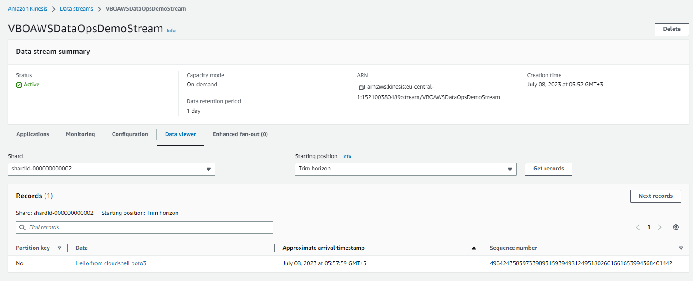

---

## Create Kinesis Data Streams
- Open Amazon Kinesis service
- Select Data streams from left menu
- Create data stream
- Data stream name: `KinesisTrain`
- Data stream capacity: On-demand
- Create data stream

## Produce records
- Open cloudshell
- Open python shell `python3`
```python
import boto3 

kinesis_client = boto3.client('kinesis')


response = kinesis_client.put_record(StreamName='KinesisTrain', Data='Hello from cloudshell boto3'.encode('utf8'), PartitionKey='No')

print(response)
```
- Learn the shard number record sent from response print.

## Consume records
- On Kinesis data stream VBOAWSDataOpsDemoStream web console
- Select Data viewer tab
- Select shard
- Click get records
---



---

## Delete data streams