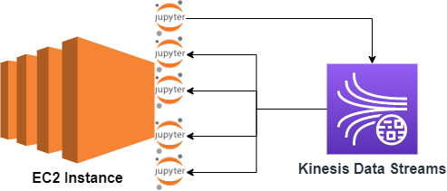

---
## Create IAM role for Kinesis Data Streams (If you don't know IAM Role you can check my AWS_Basics repo)
- Create role with permission AmazonKinesisFullAccess
- Name ec2-kinesis-full

## Create EC2 Instance for Jupyter Lab
- Upload notebooks from "notebooks" folder
- With producer notebook create kinesis data streams and produce records.
- Open consumers and consume records 