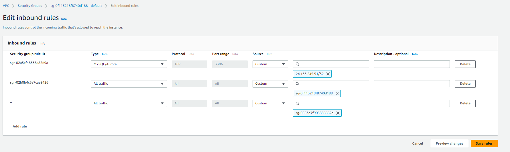

- Blog: https://docs.aws.amazon.com/msk/latest/developerguide/getting-started.html


---

## Step 1: Create an Amazon MSK cluster
- Amazon MSK service -> Create cluster
- Creation method: `Quick create` 
- Cluster name: `MSKTrain`
- Cluster type: `Provisioned`
- Apache Kafka version: `3.4.0`
- Broker type: `kafka.t3.small`
- Amazon EBS Storage per broker: `2` GiB
- From the table under All cluster settings, copy the values of the following settings and save them because you need them later in this tutorial, for example:
  - VPC: `vpc-0769ee73f0727dbf2 (default)` yours might be different.
  - Subnets:
    - subnet-0606246ffb909824f 
    - subnet-063d9ab17e6a99bb2 
    - subnet-06d1a3540638edd58
  - Security groups associated with VPC: sg-0f113218f8740d188
- Create cluster
- It will take more than 15 minutes. 
- Continue Step 2
## Step 2: Create an IAM role
### 2.1. Create policy
- Open IAM service
- Policies -> Create Policy
- Choose the JSON tab, then replace the JSON in the editor window with the following JSON. 
  - Replace `region` with your cluster region for example eu-central-1. 
  - Replace `Account-ID` with your account ID. It is a number right top corner copy it. 
  - Replace `Kafka-Cluster-Name` with the name of your cluster.

```json
{
    "Version": "2012-10-17",
    "Statement": [
        {
            "Effect": "Allow",
            "Action": [
                "kafka-cluster:Connect",
                "kafka-cluster:AlterCluster",
                "kafka-cluster:DescribeCluster"
            ],
            "Resource": [
                "arn:aws:kafka:<region>:<Account-ID>:cluster/<Kafka-Cluster-Name>/*"
            ]
        },
        {
            "Effect": "Allow",
            "Action": [
                "kafka-cluster:*Topic*",
                "kafka-cluster:WriteData",
                "kafka-cluster:ReadData"
            ],
            "Resource": [
                "arn:aws:kafka:<region>:<Account-ID>:topic/<Kafka-Cluster-Name>/*"
            ]
        },
        {
            "Effect": "Allow",
            "Action": [
                "kafka-cluster:AlterGroup",
                "kafka-cluster:DescribeGroup"
            ],
            "Resource": [
                "arn:aws:kafka:<region>:<Account-ID>:group/<Kafka-Cluster-Name>/*"
            ]
        }
    ]
}
```
- name: `msk-tutorial-policy`
- Create policy

### 2.2 Create role
- IAM -> Roles -> Create role
- Common use cases, choose EC2, then choose Next: Permissions
- Select `msk-tutorial-policy`
- Name: `msk-tutorial-role`
- Create role


## Step 3: Create a client machine (EC2)
- EC2 -> Create instance 
- Name: `MSKTutorialClient`
- Advanced details: IAM instance profile -> `msk-tutorial-role`
- Create instance
- Choose View Instances. Then, in the Security Groups column, choose the security group that is associated with your new instance. Copy the ID of the security group, and save it for later. For example: sg-0553d7f905856662d
- Go to security groups and find kafka SG, you noted above. For example: sg-0f113218f8740d188
- Add inbound rule all traffic and ec2 SG id



---

## Step 4: Create a topic
- SSH to your EC2 machine
- Install java11 `sudo yum -y install java-11`
- Download kafka binaries. `wget https://archive.apache.org/dist/kafka/3.4.0/kafka_2.13-{YOUR MSK VERSION}.tgz`
- Untar it: `tar -xzf kafka_2.13-3.4.0.tgz`
- Go to the `kafka_2.13-3.4.0/libs` directory, then run the following command to download the Amazon MSK IAM JAR file. The Amazon MSK IAM JAR makes it possible for the client machine to access the cluster.
  - `wget https://github.com/aws/aws-msk-iam-auth/releases/download/v1.1.1/aws-msk-iam-auth-1.1.1-all.jar`
- Go to the `kafka_2.13-3.4.0/bin` directory. Copy the following property settings and paste them into a new file. Name the file `client.properties` and save it.
```properties
security.protocol=SASL_SSL
sasl.mechanism=AWS_MSK_IAM
sasl.jaas.config=software.amazon.msk.auth.iam.IAMLoginModule required;
sasl.client.callback.handler.class=software.amazon.msk.auth.iam.IAMClientCallbackHandler
```
- From Kafka cluster learn `BootstrapServerString`. Click cluster name -> Choose View client information.
  - For example: `b-2.msktrain.pe0fl8.c3.kafka.eu-central-1.amazonaws.com:9098,b-3.msktrain.pe0fl8.c3.kafka.eu-central-1.amazonaws.com:9098,b-1.msktrain.pe0fl8.c3.kafka.eu-central-1.amazonaws.com:9098`
- Create topic
```commandline
./kafka-topics.sh --create \
--bootstrap-server <BootstrapServerString> \
--command-config client.properties \
--replication-factor 3 --partitions 1 --topic MSKTutorialTopic
```
If the command succeeds, you see the following message: `Created topic MSKTutorialTopic.`

## Step 5: Produce and consume data
### First terminal for producer
```commandline
./kafka-console-producer.sh --broker-list <BootstrapServerString> \
--producer.config client.properties \
--topic MSKTutorialTopic
```
### Second terminal for producer
```commandline
./kafka-console-consumer.sh --bootstrap-server <BootstrapServerString> \
--consumer.config client.properties \
--topic MSKTutorialTopic
```

- Send some messages from producer terminal and observe them in comsumer.

## Step 6: Delete the AWS resources created for this tutorial
- Delete kafka cluster
- Delete EC2 Instance
- Delete role
- Delete policy